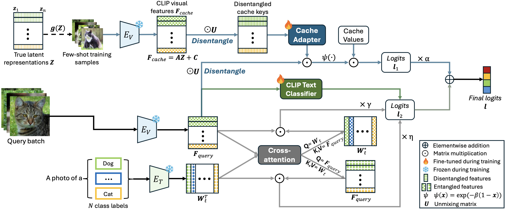

# Causal CLIP Adapter (CCA)
Official implementation of ['Causal Disentanglement and Cross-Modal Alignment for Enhanced Few-Shot Learning'](https://arxiv.org/abs/2508.03102).

The paper has been accepted by **ICCV 2025**.

## Abstract
Few-shot learning (FSL) often requires effective adaptation of models using limited labeled data. 
However, most existing FSL methods rely on entangled representations, requiring the model to implicitly 
recover the unmixing process to obtain disentangled representations using only limited supervision, 
which hinders effective adaptation. Recent theoretical studies show that multimodal contrastive learning 
methods, such as CLIP, can disentangle latent representations up to linear transformations. 
In light of this, we propose the Causal CLIP Adapter (CCA), a novel framework that explicitly 
disentangles visual features extracted from CLIP using unsupervised Independent Component Analysis (ICA). 
This removes the need to learn the unmixing process from the labeled data, thereby reducing the number of 
trainable parameters and mitigating overfitting. Taking a step further, while ICA can obtain visual 
disentangled representations, it may also disrupt CLIP's intra- and inter-modal alignment. 
To counteract this, CCA further leverages CLIP's inherent cross-modal alignment by enhancing it in two ways:
unidirectionally, through fine-tuning a CLIP-based text classifier, and bidirectionally, 
via a cross-attention mechanism that enriches visual and textual representations through mutual interaction.
Both unimodal and cross-modal classification outputs can be effectively combined linearly to improve 
classification accuracy. Extensive experiments on 11 benchmark datasets demonstrate that our method 
consistently outperforms state-of-the-art approaches in terms of few-shot performance and robustness 
to distributional shifts, while maintaining computational efficiency. 


<div align="center">
  
</div>

## Requirements
### Installation
Create a conda environment and install dependencies:
```bash
git clone https://github.com/tianjiao-j/CCA.git
cd CCA

conda create -n cca python=3.9
conda activate cca

pip install -r requirements.txt

# Install the according versions of torch and torchvision
conda install pytorch torchvision cudatoolkit
```

### Dataset
Follow [DATASET.md](https://github.com/tianjiao-j/CCA/blob/main/DATASET.md) to install the datasets (consistent with the CoOp setup).

## Get Started
### Configs
The running configurations can be modified in `configs/dataset.yaml`.

### Running
For ImageNet dataset:
```bash
python main_imagenet.py --config configs/imagenet.yaml --shot 1
```
For other 10 datasets:
```bash
python main.py --config configs/dataset.yaml --shot 1
```

## Acknowledgement
This repo benefits from [Tip-Adapter](https://github.com/gaopengcuhk/Tip-Adapter) and [CoOp](https://github.com/KaiyangZhou/CoOp). We thank the authors for their impactful works.

## Citation
```bash
@inproceedings{jiang2025causal,
  title={Causal Disentanglement and Cross-Modal Alignment for Enhanced Few-Shot Learning},
  author={Jiang, Tianjiao and Zhang, Zhen and Liu, Yuhang and Shi, Javen Qinfeng},
  booktitle={Proceedings of the IEEE/CVF International Conference on Computer Vision},
  pages={890--900},
  year={2025}
}
```

## Contact
For any questions regarding this project, you are welcome to reach out at tianjiao.jiang@adelaide.edu.au.